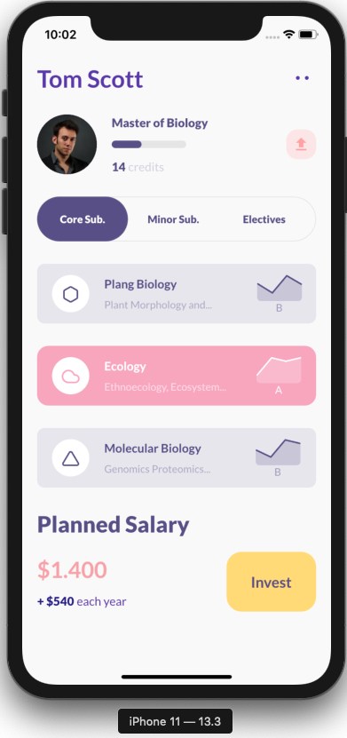

# flutter_student_app

This project was used to create a flutter student profile screen.

This is my first screen design in an attempt to learn flutter.

## Resources

This inspiration for this was from a dribble post:

dribble link: https://dribbble.com/shots/11458805-Invest-in-students-app-interaction-design

  
   

